# TP 1 Introdução à IA - Agentes Conversacionais de Busca

Este projeto implementa um agente conversacional que interage com o mundo usando um grande modelo de linguagem que, a partir de um conjunto de instruções, é capaz de responder ao usuário e, quando necessário, realizar o planejamento de uma tarefa utilizando um algoritmo de busca. Desenvolvido em Python e C++.


## 📁 Estrutura do Projeto

```
TP 1/
├── agents/
│   ├── __pycache__/
│   │   └── arquivos cache      
│   │
│   ├── cache/
│   │   └── arquivos cache 
│   │
│   ├── agent_tools.py          # Ferramentas para o agente         
│   └── agent.py                # Agente conversacional com interface em linguagem natural
│
├── build/                      # (criada automaticamente)
│   ├── file.o
│   ├── graph_search.o
│   ├── integration.o
│   └── tp1                     # Executável com algoritmo de busca
│
├── data/                       # (criada automaticamente)
│   ├── grafo.txt               # Grafo exportado em formato de texto
│   ├── cidade.graphml          # Grafo completo salvo em cache (OSMnx)
│   ├── search_result.txt       # Arquivo com resultado da busca
│   ├── route_gif.png           # GIF da rota mais recente gerada
│   └── route.png               # Imagem da rota mais recente gerada
│
├── graph_creation/ 
│   ├── __pycache__/
│   │   └── arquivos cache    
│   │         
│   └── graph_create.py         # Cria o grafo com pontos de interesse
│
├── graph_search/               # Cria a classe grafo com funçoes de busca (A* ou Dijkistra)
│   ├── include/
│   │   ├── file.hpp
│   │   └── graph_search.hpp
│   │
│   └── src/
│       ├── file.cpp
│       ├── graph_search.cpp
│       └── integration.cpp     # Executável com main, que cria o grafo e aplica as buscas (A* ou Dijkistra)
│
├── README_image/               # Pasta com as imagens do README
│
├── Documentacao.pdf
├── Makefile                    # Compilação e limpeza da parte C++
├── requirements.txt            # Bibliotecas python necessarias
└── README.md
```

## ⚙️ Configurações para teste

* Sistema Operacional do computador: Windows 11; 
* Linguagem de programação implementada: Python e C++;
* Compilador utilizado: G++ da GNU Compiler Collection; 
* Processador: i7;
* Quantidade de memória RAM: 16GB.
* Placa de vídeo: RTX2060.

## 🔧 Requisições do projeto

### Biblioteca python

Para que o projeto rode, é necessário a instalação de algumas bibliotecas python:

* osmnx==2.0.2
* pandas==2.2.2
* imageio==2.37.0
* Pillow==11.2.1
* networkx==3.4.2
* matplotlib==3.8.2
* smolagents[litellm]==1.14.0
* gradio====5.29.0

Para instalar bastar utilizar o arquivo `requirements.txt`:

```bash
pip3 install -r requirements.txt
```

### Modelo LLM local com Ollama

Este projeto utiliza um modelo de linguagem local (LLM) executado via [Ollama](https://ollama.com/) para interagir com o agente conversacional.

#### Requisitos

- Ter o Ollama instalado em sua máquina (disponível para Windows, macOS e Linux).  
  Você pode baixá-lo e instalá-lo através do site oficial: [https://ollama.com](https://ollama.com)

#### Como rodar o modelo

Após a instalação, você deve baixar e iniciar o modelo **QWEN 3** com o seguinte comando:

```bash
ollama run qwen3
```
⚠️ Na primeira execução, este comando fará o download do modelo qwen3, o que pode levar alguns minutos e ocupar alguns GBs de espaço em disco.

O Ollama executa um servidor local que é utilizado automaticamente pelo agente durante as interações. Certifique-se de manter o Ollama rodando enquanto utilizar o projeto (você pode deixar rodando em um terminal e executar o projeto em outro).


## ⚙️ Compilando a Parte C++

`Não é necessário compilar estes arquivos, o agente faz isso.`

Entretanto, se quiser testar somente os algoritmos de busca, você pode compilar o código c++ utilizando o Makefile:

```bash
make
```

ou

```bash
make build
```

O executável será gerado em `build/tp1`.

## 🧹 Limpeza

Para remover a pasta build com os obj e o exe:

```bash
make clean  
```

ou

Para remover a pasta build e a pasta data com os dados gerados:

```bash
make clean_all
```

## ⚙️ Executando tp1.exe

```bash
tx1.exe <arquivo.txt> <modo (1 = saida padrao | 2 = arquivo)> (default = 2)
```

Para o projeto, é esperado que seja gerado o arquivo com o resultado da busca (modo 2). Entretanto, para testar os algoritmos, utilizar a saída padrão é mais interessante (modo 1).

Independente do modo de saída, o programa espera que insira, pela entrada padrão, o id de um nó de origem, o id de um nó de destino e o algoritmo de busca utilizado (astar ou dijkstra).

Para o modo de saída em arquivo, o resultado com a distancia total e o caminho percorrido é armazenado em `data/search_result.txt`

`Para o projeto, não é necessário compilar manualmente. O agente faz isso.` 


## 📺 Executando `graph_create.py`

```bash
python3 graph_create.py
```

Esse script gera um grafo com pontos de interesse (por padrão: **universidades em Belo Horizonte**) e salva os arquivos:

* `data/grafo.txt`: grafo em formato legível
* `data/<cidade>.graphml`: grafo em cache

`Para o projeto, não é necessário gerar o grafo manualmente. O agente faz isso.` 

## 🤖 Executando o Agente Conversacional

Em um terminal, dentro da pasta `TP 1`, execute:

```bash
ollama run qwen3
```

Em um segundo terminal, dentro da pasta `TP 1/agents/`, execute:

```bash
set PYTHONUTF8=1
python3 agent.py
```

`⚠️ IMPORTANTE:` No navegador, abra uma guia com a url local: http://127.0.0.1:7860/

A interação com o agente de rotas será feito nela!

Ao iniciar, o agente gera o grafo padrão com universidades em Belo Horizonte, compila o código c++ e espera por comandos do usuário para rodar os algoritmos de busca A* ou Dijkstra.

## 🗣️ Interagindo com o Agente

`⚠️ No navegador, abra uma guia com a url local: http://127.0.0.1:7860/ onde será feita a interação com o agente`

### 1. Listar as universidades disponíveis

Basta perguntar quais são as universidades disponíveis:

```
Quais são as universidades disponíveis?
```

#### Resultado esperado

O agente deve responder com uma lista de todas as universidades.

### 2. Buscar uma rota

Basta informar a origem e o destino pelo nome e o algoritmo de busca que deseja utilizar:

As opções de algoritmo são:

* `astar`: A* - Algoritmo de busca com informação (A heurística utilizada avalia a distância euclidiana entre os nós)
* `dijkstra`: Dijkstra - Algoritmo de busca sem informação

```
Quero ir da Universidade X para a Universidade Y usando astar

ou 

Qual a melhor rota entre Universidade X e Universidade Y usando dijkstra
```

#### Resultado esperado

O agente deve responder com uma descrição da rota, listando todos os nós do caminho pelo ID e se o nó for uma universidade, o nome dela. No final deve mostrar a distancia total da rota.

Além disso, serão exibidos uma imagem e um GIF da rota no final da página.

## 🔧 Arquivos e Integração

### Arquivos Individuais

* `agent_tools.py`: Funções usadas pelo agente: gera o grafo, compila o C++, executa os algoritmos e mostra o resultado.
* `agent.py`: Interface conversacional com LLM: cria as ferramentas para o agente utilizando as funções de agent_tools.py.
* `tp1.exe`: Executável da parte de busca.
* `cidade.graphml`: Grafo completo da cidade salvo em cache (OSMnx).
* `grafo.txt`: Grafo exportado em formato de texto.
* `route_gif.png`: Resultado visual animado da rota gerada.
* `route.png`: Resultado visual da rota gerada.
* `search_result.txt`: Resultado da rota gerada.
* `graph_create.py`: Gera o grafo a partir do OSM com tags desejadas.
* `file/*.cpp / *.hpp`: Classe File para manipular arquivos em C++.
* `graph_search/*.cpp / *.hpp`: Classe Graph com algoritmos de busca em C++.
* `integration.cpp`: Main onde cria o grafo e aplica busca em C++.
* `Documentacao.pdf`: Documentacao do TP.
* `Makefile`: Facilita compilação e limpeza.
* `requirements.txt`: Bibliotecas python necessarias.

### Integração

1. O agente `agent.py` usa `agent_tools.py` para gerar o grafo `grafo.txt` e compilar o código c++. 
2. Ao solicitar uma rota, ele executa o código c++ com o grafo `grafo.txt`, IDs dos nós de origem e destino e o algoritmo.
3. Os resultados são armazenados em um arquivo `search_results.txt`.
4. Os resultados são lidos e é criada uma descrição da rota, além de converte-la em imagem (`route.png`) e em GIF (`route_gif.gif`).

O agente é capaz de compilar a parte C++, gerar grafo, executar o algoritmo, e responder em linguagem natural.

## 📄 Documentação

### a. Descrição do Problema

```
    Este projeto trata do problema de encontrar a rota mais curta entre universidades em Belo Horizonte, utilizando um algoritmo de busca sem informação (Dijkstra) ou um algoritmo de busca com informação (A*), sendo que heurística utilizada avalia a distância euclidiana entre os nós. O objetivo é permitir que um agente conversacional receba uma solicitação do usuário, identifique a origem e o destino (entre universidades), e determine o melhor caminho a ser percorrido, tanto em termos de distância, descrevendo a rota encontrada, informando a distância total e gerando uma imagem e uma animação da rota. 

    O grafo utilizado foi construído a partir de dados reais obtidos via OpenStreetMap, com o auxílio da biblioteca OSMnx. Ele representa o sistema viário da cidade de Belo Horizonte - MG, filtrado para incluir apenas locais classificados como universidades.

    - Número de nós: 2149
    - Número de arestas: 3098 (no arquivo grafo.txt aparece o dobro, mas é para indicar que são não direcionadas)
    - Número de destinos (universidades): 39 (As que aparecem com o mesmo nome são unidades diferentes. Entretanto não foi especificado de qual unidade se trata)
    - Algoritmos implementados: Dijkstra e A* 

    Esses algoritmos foram implementados em C++ por questões de desempenho e são integrados com a interface Python por meio de arquivos intermediários e um sistema de compilação automatizado.
```

### b. Arquitetura do Sistema

```
A arquitetura da solução foi desenhada para integrar três componentes principais:

1- Interface Conversacional (Agente com SmolAgents + Gradio) - Arquivo agent.py:

    * O agente implementado utiliza a LLM qwen3.
    
    * Existem duas ferramentas (@tool) implementadas para o agente. 
        
        - A primeira (list_nodes_tool) lista todas as universidades existentes no grafo. 
        
        - A segunda (search_route_tool) encapsula funcionalidades. Ela busca a rota e a distancia total, e gera a imagem e o GIF da rota.

    * As ferramentas são criadas com base nas funções implementadas em agent_tools.py.

    * agent_tools.py integra os componentes do projeto com funções que rodam os outros códigos implementados. Existem funções para criar o grafo, compilar c++ e executar os algoritmos de busca no c++ compilado. Além disso, tem funções para criar a imagem e o GIF da rota, e para criar uma descrição da rota com base no resultado gerado pelo executável.

    * Com o Gradio, é criado uma interface para interação com o usuário. Permitindo que sejam feitas solicitações ao agente, receber as respostas e visualizar imagem e GIF gerados.

2- Construção e Manipulação do Grafo (Python com OSMnx) - Arquivo graph_create.py:

    * O grafo é criado a partir de dados do OpenStreetMap usando a biblioteca OSMnx.

    * Cada nó do grafo representa um ponto geográfico com coordenadas, nome e tipo.

    * A representação do grafo é salva em arquivo intermediário (grafo.txt) que é lido pelo módulo C++.

    * A função create_graph deste arquivo é chamada pela função initialize_graph do agent_tools.py

3- Execução dos Algoritmos de Busca (C++):

    * Os algoritmos Dijkstra e A* foram implementados em C++ por eficiência.

    * Um Makefile compila o código. agent_tools.py possui a função compile_cpp_code que usa esse Makefile.

    * A função run_search do agent_tools.py roda o executável.
    
    * O executável recebe o grafo (grafo.txt) por linha de comando e pela entrada padrão recebe origem, destino e algoritmo, gerando a rota e a distancia total como saída em um arquivo (search_results.txt).

A comunicação entre os componentes é feita por meio de arquivos e chamadas de sistema (subprocess.run), garantindo modularidade e fácil depuração.
```

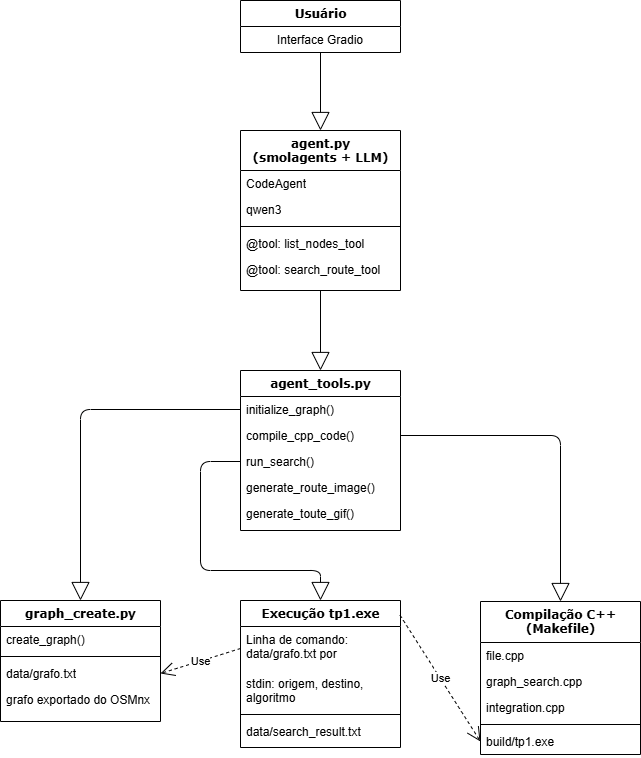

### c. Prompts Testados


1 - Quais são as universidades disponíveis? 

```
CEFET-MG - Campus II
CEFET-MG - Campus VI
Campus Pampulha da Universidade Federal de Minas Gerais
Centro Esportivo Universo
Centro Universitário UNA
Centro Universitário UNA
Centro Universitário UniHorizones
Centro Universitário de Belo Horizonte
Escola Guignard - UEMG
Escola de Arquitetura da UFMG
Escola de Design - UEMG
Escola de Veterinária
Escritório de Representação da UFV
Estácio Polo EAD Santa Inês
Estácio de Sá
Faculdade Anhanguera - Campus Antônio Carlos
Faculdade Jesuíta de Filosofia e Teologia
Faculdade Pitágoras
Faculdade Pitágoras
Faculdade Pitágoras
Faculdade Pitágoras
Faculdade Unimed
Faculdade Universo
Faculdade de Ciências Médicas de Minas Gerais
Fundação João Pinheiro - Campus Pampulha
Ibmec
Instituto de Geociências
PUC Minas - Campus Barreiro
PUC Minas - Campus São Gabriel
Pontifícia Universidade Católica de Minas Gerais
UNA - Centro universitário
UNA Aimorés
UNI-BH campus Lagoinha
UNIFENAS
Universidade Federal de Minas Gerais - campus Saúde
Universidade Fumec
Universidade José do Rosário Vellano
Universidade Newton Paiva
Universidade Prof.Edson Antônio Velano - Unifenas - Câmpus BH, Unidade
Jaraguá
``` 

2 - Quais são as universidades de BH?

```
CEFET-MG - Campus II
CEFET-MG - Campus VI
Campus Pampulha da Universidade Federal de Minas Gerais
Centro Esportivo Universo
Centro Universitário UNA
Centro Universitário UNA
Centro Universitário UniHorizones
Centro Universitário de Belo Horizonte
Escola Guignard - UEMG
Escola de Arquitetura da UFMG
Escola de Design - UEMG
Escola de Veterinária
Escritório de Representação da UFV
Estácio Polo EAD Santa Inês
Estácio de Sá
Faculdade Anhanguera - Campus Antônio Carlos
Faculdade Jesuíta de Filosofia e Teologia
Faculdade Pitágoras
Faculdade Pitágoras
Faculdade Pitágoras
Faculdade Pitágoras
Faculdade Unimed
Faculdade Universo
Faculdade de Ciências Médicas de Minas Gerais
Fundação João Pinheiro - Campus Pampulha
Ibmec
Instituto de Geociências
PUC Minas - Campus Barreiro
PUC Minas - Campus São Gabriel
Pontifícia Universidade Católica de Minas Gerais
UNA - Centro universitário
UNA Aimorés
UNI-BH campus Lagoinha
UNIFENAS
Universidade Federal de Minas Gerais - campus Saúde
Universidade Fumec
Universidade José do Rosário Vellano
Universidade Newton Paiva
Universidade Prof.Edson Antônio Velano - Unifenas - Câmpus BH, Unidade
Jaraguá
```

3 - Liste as universidades

```
CEFET-MG - Campus II
CEFET-MG - Campus VI
Campus Pampulha da Universidade Federal de Minas Gerais
Centro Esportivo Universo
Centro Universitário UNA
Centro Universitário UNA
Centro Universitário UniHorizones
Centro Universitário de Belo Horizonte
Escola Guignard - UEMG
Escola de Arquitetura da UFMG
Escola de Design - UEMG
Escola de Veterinária
Escritório de Representação da UFV
Estácio Polo EAD Santa Inês
Estácio de Sá
Faculdade Anhanguera - Campus Antônio Carlos
Faculdade Jesuíta de Filosofia e Teologia
Faculdade Pitágoras
Faculdade Pitágoras
Faculdade Pitágoras
Faculdade Pitágoras
Faculdade Unimed
Faculdade Universo
Faculdade de Ciências Médicas de Minas Gerais
Fundação João Pinheiro - Campus Pampulha
Ibmec
Instituto de Geociências
PUC Minas - Campus Barreiro
PUC Minas - Campus São Gabriel
Pontifícia Universidade Católica de Minas Gerais
UNA - Centro universitário
UNA Aimorés
UNI-BH campus Lagoinha
UNIFENAS
Universidade Federal de Minas Gerais - campus Saúde
Universidade Fumec
Universidade José do Rosário Vellano
Universidade Newton Paiva
Universidade Prof.Edson Antônio Velano - Unifenas - Câmpus BH, Unidade
Jaraguá
```

4 - Voce pode me dizer quais sao os pontos disponiveis para pesquisa no grafo?

```
CEFET-MG - Campus II
CEFET-MG - Campus VI
Campus Pampulha da Universidade Federal de Minas Gerais
Centro Esportivo Universo
Centro Universitário UNA
Centro Universitário UNA
Centro Universitário UniHorizones
Centro Universitário de Belo Horizonte
Escola Guignard - UEMG
Escola de Arquitetura da UFMG
Escola de Design - UEMG
Escola de Veterinária
Escritório de Representação da UFV
Estácio Polo EAD Santa Inês
Estácio de Sá
Faculdade Anhanguera - Campus Antônio Carlos
Faculdade Jesuíta de Filosofia e Teologia
Faculdade Pitágoras
Faculdade Pitágoras
Faculdade Pitágoras
Faculdade Pitágoras
Faculdade Unimed
Faculdade Universo
Faculdade de Ciências Médicas de Minas Gerais
Fundação João Pinheiro - Campus Pampulha
Ibmec
Instituto de Geociências
PUC Minas - Campus Barreiro
PUC Minas - Campus São Gabriel
Pontifícia Universidade Católica de Minas Gerais
UNA - Centro universitário
UNA Aimorés
UNI-BH campus Lagoinha
UNIFENAS
Universidade Federal de Minas Gerais - campus Saúde
Universidade Fumec
Universidade José do Rosário Vellano
Universidade Newton Paiva
Universidade Prof.Edson Antônio Velano - Unifenas - Câmpus BH, Unidade
Jaraguá
```

5 - Qual o melhor caminho entre Campus Pampulha da Universidade Federal de Minas Gerais e PUC Minas - Campus Barreiro usando astar?

```
Rota encontrada com sucesso!

Saindo do no 351982124 que e o(a) Campus Pampulha da Universidade Federal de Minas Gerais,
vamos para o no 27589563,
depois para o no 28404409,
depois para o no 28404508,
depois para o no 8936627355,
depois para o no 8936627353,
depois para o no 448283431,
depois para o no 28404678,
depois para o no 1830888189,
depois para o no 28293871,
depois para o no 28634937,
depois para o no 448294617,
depois para o no 61851825,
depois para o no 1466399473,
depois para o no 1466344681,
depois para o no 94879231,
depois para o no 94879238,
depois para o no 353574346,
depois para o no 94880300,
depois para o no 1735086877,
depois para o no 94895935,
depois para o no 94896557,
depois para o no 10250636625,
depois para o no 29601600,
depois para o no 8213029691
e por fim chegamos ao no 319531371 que e o(a) PUC Minas - Campus Barreiro.
Com uma distancia total de 9942.12 metros.

📷 Imagem da rota: ../data/route.png
🎞 GIF animado da rota: ../data/route_gif.png
```

6 - Qual o melhor caminho entre Campus Pampulha da Universidade Federal de Minas Gerais e PUC Minas - Campus Barreiro usando dijkstra?

```
Rota encontrada com sucesso!

Saindo do no 351982124 que e o(a) Campus Pampulha da Universidade Federal de Minas Gerais,
vamos para o no 27589563,
depois para o no 28404409,
depois para o no 28404508,
depois para o no 8936627355,
depois para o no 8936627353,
depois para o no 448283431,
depois para o no 28404678,
depois para o no 1830888189,
depois para o no 28293871,
depois para o no 28634937,
depois para o no 448294617,
depois para o no 61851825,
depois para o no 1466399473,
depois para o no 1466344681,
depois para o no 94879231,
depois para o no 94879238,
depois para o no 353574346,
depois para o no 94880300,
depois para o no 1735086877,
depois para o no 94895935,
depois para o no 94896557,
depois para o no 10250636625,
depois para o no 29601600,
depois para o no 8213029691
e por fim chegamos ao no 319531371 que e o(a) PUC Minas - Campus Barreiro.
Com uma distancia total de 9942.12 metros.

📷 Imagem da rota: ../data/route.png
🎞 GIF animado da rota: ../data/route_gif.png 
```

7 - Quero a menor rota do CEFET-MG - Campus II até UNIFENAS usando A*

```
Rota encontrada com sucesso!

Saindo do no 2313761819 que e o(a) CEFET-MG - Campus II,
vamos para o no 2313761825,
depois para o no 95185790,
depois para o no 9397154136,
depois para o no 8681421235,
depois para o no 319249481,
depois para o no 317007484,
depois para o no 63012956,
depois para o no 4987462491,
depois para o no 4987462495,
depois para o no 4987462490,
depois para o no 63012724,
depois para o no 61853332,
depois para o no 61853088,
depois para o no 8880365273,
depois para o no 29649875,
depois para o no 61852415,
depois para o no 61853622,
depois para o no 2053040746,
depois para o no 61852305,
depois para o no 3226740761,
depois para o no 3226740763,
depois para o no 28634969,
depois para o no 63333890,
depois para o no 28634961,
depois para o no 28634958,
depois para o no 28634946,
depois para o no 28634937,
depois para o no 28293871,
depois para o no 1830888189,
depois para o no 28404678,
depois para o no 448283431,
depois para o no 8936627353,
depois para o no 8936627355,
depois para o no 28404508,
depois para o no 28404409,
depois para o no 27589563,
depois para o no 351982124 que e o(a) Campus Pampulha da Universidade Federal de Minas Gerais,
depois para o no 31882615,
depois para o no 355770103,
depois para o no 31893990,
depois para o no 31894064,
depois para o no 355770100,
depois para o no 2285761114,
depois para o no 351980159,
depois para o no 3094895781,
depois para o no 3321924855,
depois para o no 3321932693,
depois para o no 3321924814,
depois para o no 27797342,
depois para o no 308048775,
depois para o no 308048774,
depois para o no 1585528037,
depois para o no 1585528040,
depois para o no 322058266,
depois para o no 29096351,
depois para o no 29096523,
depois para o no 29095808,
depois para o no 27564536,
depois para o no 6829144382,
depois para o no 1578962765,
depois para o no 6829144376
e por fim chegamos ao no 29096615 que e o(a) UNIFENAS.
Com uma distancia total de 16018.30 metros.

📷 Imagem da rota: ../data/route.png
🎞 GIF animado da rota: ../data/route_gif.png 
```

8 - Quero a menor rota do CEFET-MG - Campus II até UNIFENAS usando Dijkstra

```
Rota encontrada com sucesso!

Saindo do no 2313761819 que e o(a) CEFET-MG - Campus II,
vamos para o no 2313761825,
depois para o no 95185790,
depois para o no 9397154136,
depois para o no 8681421235,
depois para o no 319249481,
depois para o no 317007484,
depois para o no 63012956,
depois para o no 4987462491,
depois para o no 4987462495,
depois para o no 4987462490,
depois para o no 63012724,
depois para o no 61853332,
depois para o no 61853088,
depois para o no 8880365273,
depois para o no 29649875,
depois para o no 61852415,
depois para o no 61853622,
depois para o no 2053040746,
depois para o no 61852305,
depois para o no 3226740761,
depois para o no 3226740763,
depois para o no 28634969,
depois para o no 63333890,
depois para o no 28634961,
depois para o no 28634958,
depois para o no 28634946,
depois para o no 28634937,
depois para o no 28293871,
depois para o no 1830888189,
depois para o no 28404678,
depois para o no 448283431,
depois para o no 8936627353,
depois para o no 8936627355,
depois para o no 28404508,
depois para o no 28404409,
depois para o no 27589563,
depois para o no 351982124 que e o(a) Campus Pampulha da Universidade Federal de Minas Gerais,
depois para o no 31882615,
depois para o no 355770103,
depois para o no 31893990,
depois para o no 31894064,
depois para o no 355770100,
depois para o no 2285761114,
depois para o no 351980159,
depois para o no 3094895781,
depois para o no 3321924855,
depois para o no 3321932693,
depois para o no 3321924814,
depois para o no 27797342,
depois para o no 308048775,
depois para o no 308048774,
depois para o no 1585528037,
depois para o no 1585528040,
depois para o no 322058266,
depois para o no 29096351,
depois para o no 29096523,
depois para o no 29095808,
depois para o no 27564536,
depois para o no 6829144382,
depois para o no 1578962765,
depois para o no 6829144376
e por fim chegamos ao no 29096615 que e o(a) UNIFENAS.
Com uma distancia total de 16018.30 metros.

📷 Imagem da rota: ../data/route.png
🎞 GIF animado da rota: ../data/route_gif.png 
```

9 - Utilizando o algoritmo A estrela, voce pode me dizer o percurso mais eficiente entre Ibmec e Faculdade Universo?

```
Rota encontrada com sucesso!

Saindo do no 35964768 que e o(a) Ibmec,
vamos para o no 8933520485,
depois para o no 35964763,
depois para o no 3743536440,
depois para o no 2748450044,
depois para o no 35964762,
depois para o no 2748450042,
depois para o no 29160782,
depois para o no 2367527939,
depois para o no 41416571 que e o(a) Faculdade de Ciências Médicas de Minas Gerais,
depois para o no 321064810,
depois para o no 321064872,
depois para o no 321064792,
depois para o no 321068226,
depois para o no 2931027501,
depois para o no 5049706771,
depois para o no 35788246,
depois para o no 35788222,
depois para o no 32600635,
depois para o no 29095385,
depois para o no 4893037820,
depois para o no 27563812,
depois para o no 27584879,
depois para o no 7283231730,
depois para o no 31737026,
depois para o no 31737027,
depois para o no 29096190,
depois para o no 60749760,
depois para o no 29095032,
depois para o no 29095332,
depois para o no 29095361,
depois para o no 8919734816,
depois para o no 8919760929,
depois para o no 8919760927,
depois para o no 8919760917,
depois para o no 8917687105,
depois para o no 8917687104,
depois para o no 29096289,
depois para o no 29096780,
depois para o no 29095162,
depois para o no 78094639,
depois para o no 78094925
e por fim chegamos ao no 73563991 que e o(a) Faculdade Universo.
Com uma distancia total de 6536.89 metros.

📷 Imagem da rota: ../data/route.png
🎞 GIF animado da rota: ../data/route_gif.png 
```

10 - Utilizando o algoritmo dikistra, voce pode me dizer o percurso mais eficiente entre Ibmec e Faculdade Universo?

```
Rota encontrada com sucesso!

Saindo do no 35964768 que e o(a) Ibmec,
vamos para o no 8933520485,
depois para o no 35964763,
depois para o no 3743536440,
depois para o no 2748450044,
depois para o no 35964762,
depois para o no 2748450042,
depois para o no 29160782,
depois para o no 2367527939,
depois para o no 41416571 que e o(a) Faculdade de Ciências Médicas de Minas Gerais,
depois para o no 321064810,
depois para o no 321064872,
depois para o no 321064792,
depois para o no 321068226,
depois para o no 2931027501,
depois para o no 5049706771,
depois para o no 35788246,
depois para o no 35788222,
depois para o no 32600635,
depois para o no 29095385,
depois para o no 4893037820,
depois para o no 27563812,
depois para o no 27584879,
depois para o no 7283231730,
depois para o no 31737026,
depois para o no 31737027,
depois para o no 29096190,
depois para o no 60749760,
depois para o no 29095032,
depois para o no 29095332,
depois para o no 29095361,
depois para o no 8919734816,
depois para o no 8919760929,
depois para o no 8919760927,
depois para o no 8919760917,
depois para o no 8917687105,
depois para o no 8917687104,
depois para o no 29096289,
depois para o no 29096780,
depois para o no 29095162,
depois para o no 78094639,
depois para o no 78094925
e por fim chegamos ao no 73563991 que e o(a) Faculdade Universo.
Com uma distancia total de 6536.89 metros.

📷 Imagem da rota: ../data/route.png
🎞 GIF animado da rota: ../data/route_gif.png 
```

11 - Me mostre a menor distancia entre MIT e Pontifícia Universidade Católica de Minas Gerais com a*

```
MIT esta fora de alcance. 
```

12 - Me mostre a menor distancia entre Faculdade de Ciências Médicas de Minas Gerais e Harvard com Dijkstra

```
Harvard esta fora de alcance.
```

### d. Análise dos Resultados

```
    Durante os testes realizados por meio do prompt conversacional, foi possível observar que o tempo total de resposta percebido pelo usuário é significativamente impactado pela geração da imagem (route.png) e, especialmente, pela geração do GIF (route_gif.png). Essa etapa é realizada após a execução do algoritmo de busca e depende diretamente do tamanho do caminho encontrado: quanto maior a quantidade de nós na rota, maior o tempo necessário para a criação do GIF, o que contribui para a impressão de lentidão no sistema.

    No entanto, para realizar uma análise justa da eficiência dos algoritmos de busca — Dijkstra e A* —, consideramos apenas o tempo necessário para a geração do arquivo search_result.txt, que representa a saída bruta da execução do algoritmo. Esse tempo é medido logo após o executável tp1 ser chamado pelo sistema, e antes da geração de qualquer imagem.

    Ao comparar o desempenho dos algoritmos com diferentes pares de origem e destino, mantendo os mesmos parâmetros e variando apenas o algoritmo utilizado, foi possível constatar que ambos produzem os resultados de forma bastante rápida. Ainda assim, o algoritmo A* apresentou um desempenho levemente superior em cenários em que os nós de origem e destino estavam mais distantes no grafo. Essa melhoria se deve ao uso de heurísticas que guiam a busca em direção ao objetivo, reduzindo o espaço de busca explorado em comparação ao algoritmo de Dijkstra, que considera todos os caminhos possíveis com base apenas no custo acumulado.

    Portanto, embora a diferença de tempo seja pequena, especialmente em grafos de tamanho moderado, a utilização do A* pode trazer benefícios de desempenho práticos em buscas mais longas. Para o usuário final, essa diferença só será percebida se etapas como a geração de imagem e GIF forem otimizadas ou realizadas de forma assíncrona, separando claramente o tempo de busca do tempo de visualização.
```

### e. Exemplo de uso e funcionamento

Exemplo usando os dois prompts de teste:

> Quais são as universidades disponíveis?

> Qual o melhor caminho entre Campus Pampulha da Universidade Federal de Minas Gerais e PUC Minas - Campus Barreiro usando astar?

#### Interface do usuário:


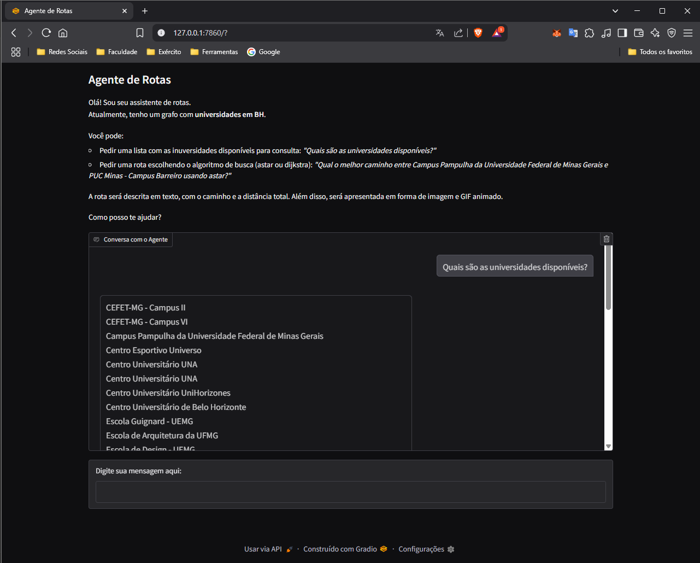
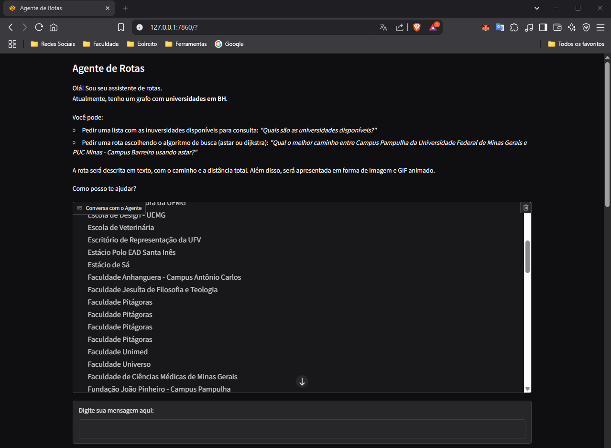
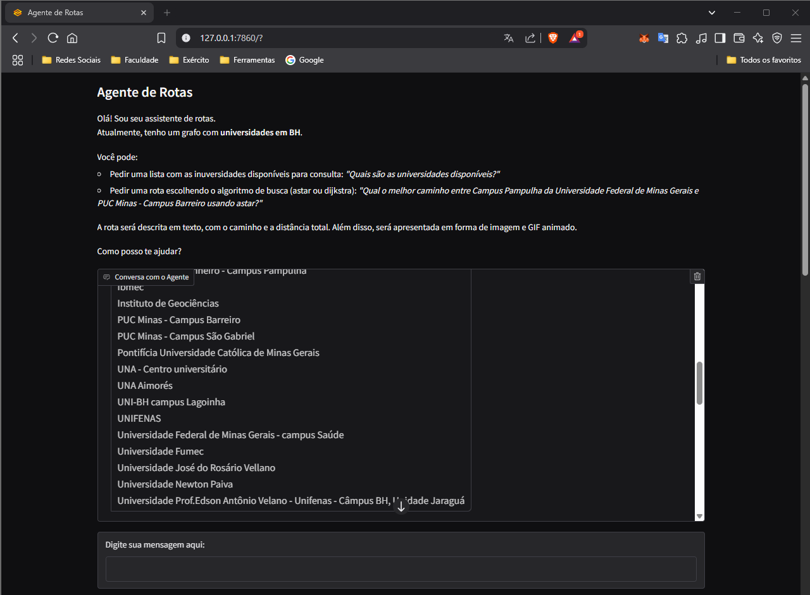
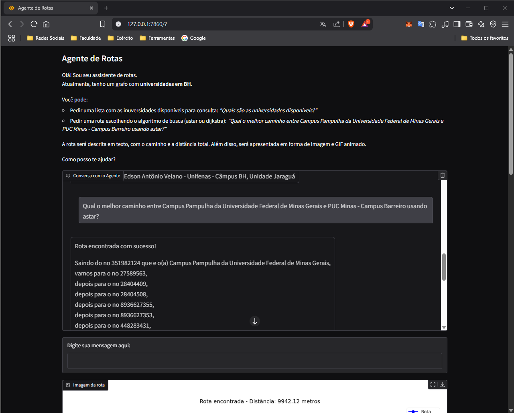
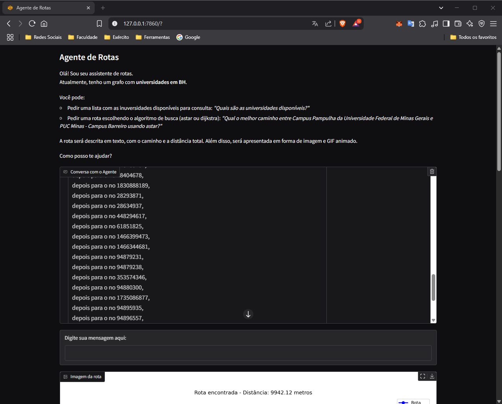
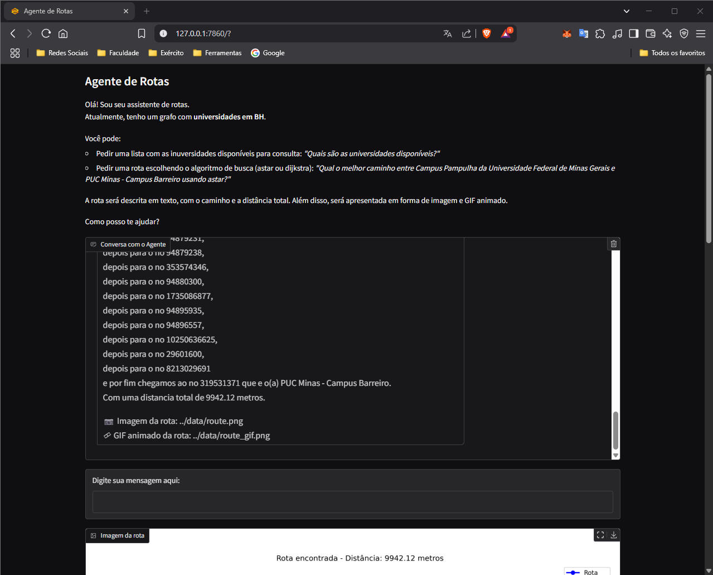
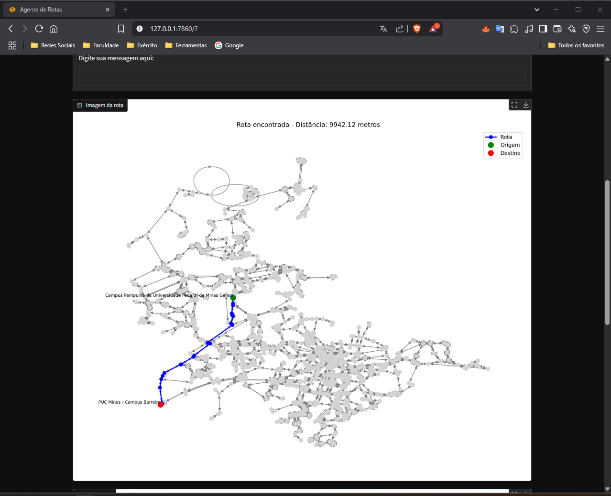
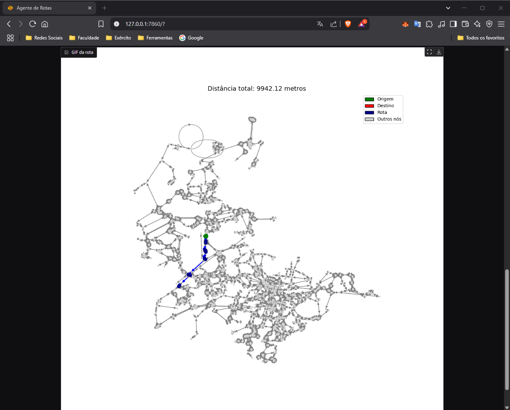

#### Funcionamento do agente para gerar a resposta:

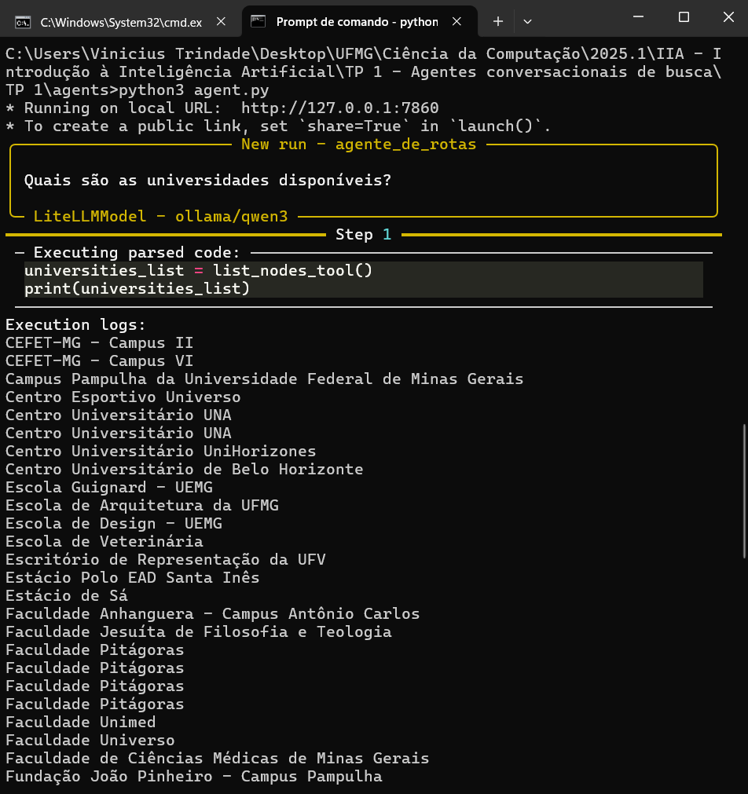
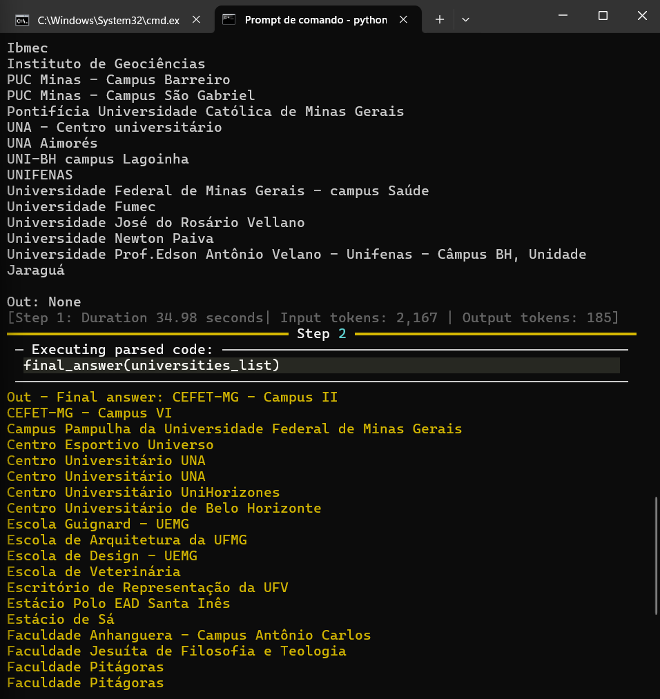
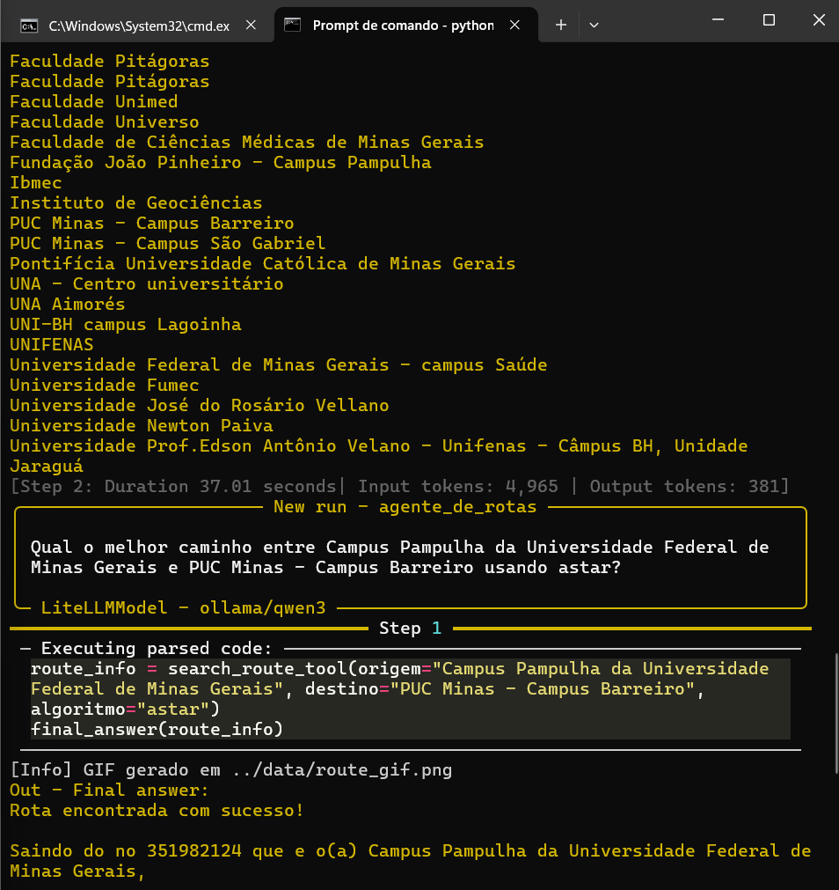
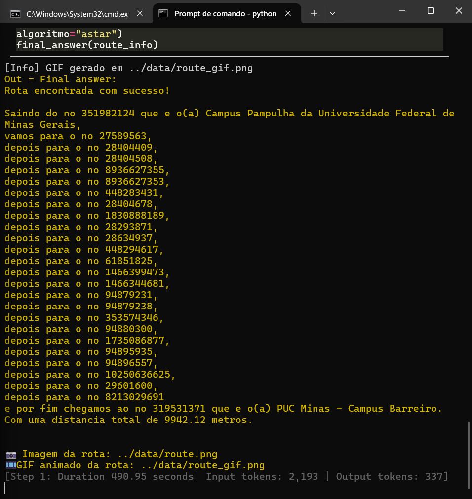

## ✏️ Autor

Vinicius Trindade - Ciência da Computação, UFMG